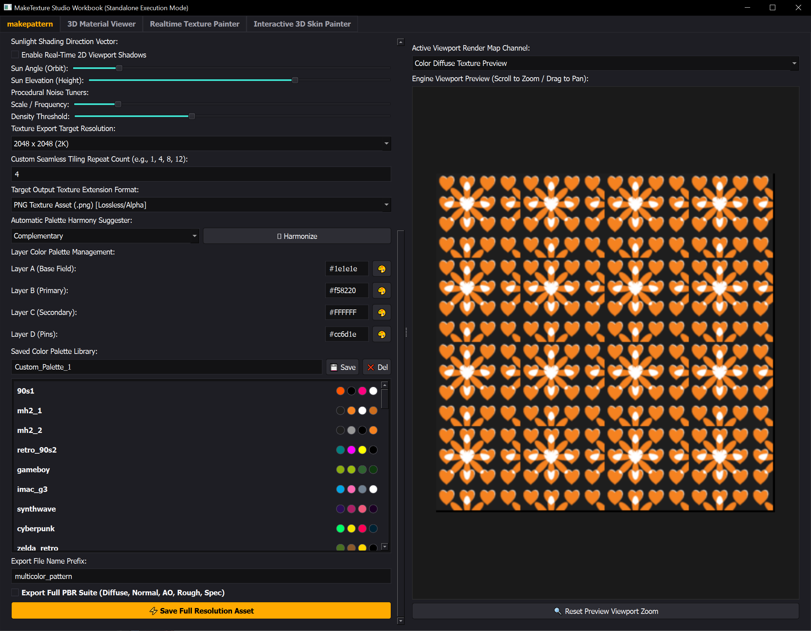
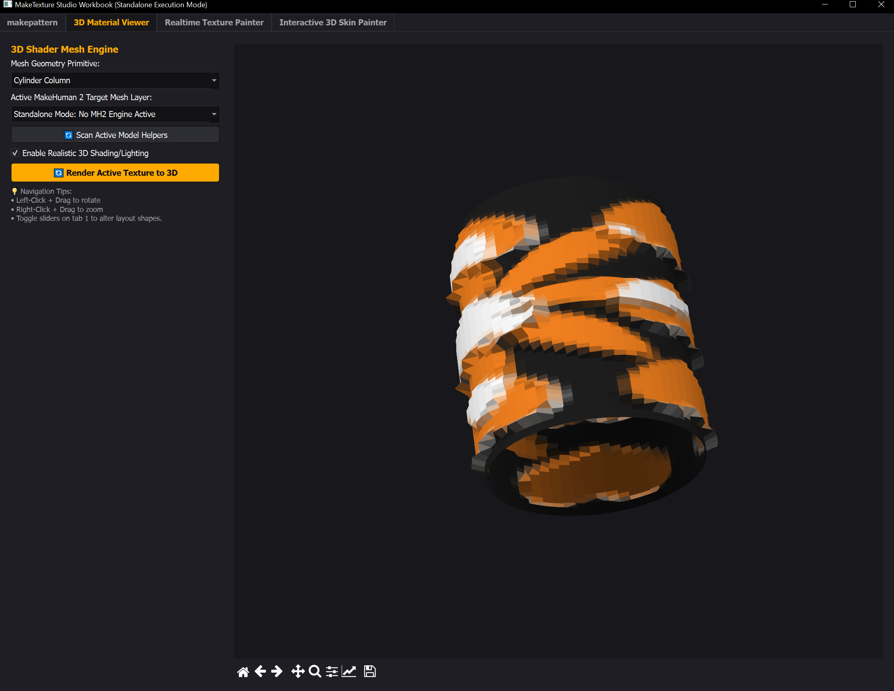

# Make_Texture

A hybrid plugin for creating textures and more  that works as a standalone python(execute with maketexureqt.py in solo mode) as well as community style plugin
for Makehuman 2 including docking(install in extensions folder of MH2 Plugin version and up in folder named exactly 'maketexture_qt', then enable plugin with the community plugin panel in MH2).

This is very much a WIP, and some features are unfinished or not implemented yet(are visible as a place holder only atm).

Requirements are included for usage, along with an easy to use install script for dependencies(for standalone mostly as mh2 packages most plugin dependencies).

# Demos  
  
  

 

# What is up and running/mostly ready:

- Pattern maker/mixer with tiling.
- Visualizer(Viewer) of said pattern/texture in map types as you create in a seperate panel.
- Exporting of said patterns with associated textures such as normal and ao maps(1 and 2k).
- Colour Palette saving/usage.
- Auto palette generator.

# What is there but needs work still:

- 3d Pattern Viewer on own tab.
- Interactive 3d painter.

# What is simply a place holder atm:

- Realtime texture painter.
